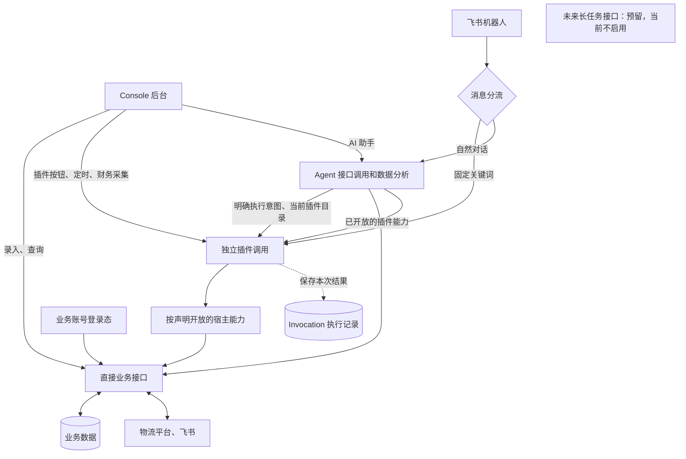

# 业务接口与独立插件调用

本轮实现依据用户确认的《架构改造方案 V1》（2026-09-09），基线为
`1d7866d092d88c07d7a6e765f288fb7549370c30`。本文定义当前代码职责，验收结果另以新鲜测试报告为准。
该架构替代旧文档中“普通查询和插件均提交 Command 并由 Runner 领取”的规定。

## AI 对话调用插件

网页 AI 助手与已绑定管理员的飞书自然对话可选择当前已安装、启用、配置完成且允许自动执行的插件。目录来自当前 committed generation；模型仅选择不含业务身份的工具句柄，宿主使用已保存的账号、资源与参数，通过该渠道现有的 Console/Feishu 入口直接发起 Invocation。执行前再次核对插件版本、设置、权限与登录状态。

模型工具说明区分插件业务用途与当前渠道的实际授权，旧说明中的“禁止 Agent”或“逐次审批”不能覆盖本次已筛选的调用权限；限制以宿主实际返回为准。界面使用插件名称并保留实例名称以区分同包多实例。

同一句话可选择多个不同插件分别启动；同一次请求重读结果不重复启动。明确的飞书固定命令仍直接进入原入口。普通运单/轨迹/财务查询保持原只读接口，模型不能任意调用 HTTP、业务脚本或修改插件设置。未指定清楚插件实例、要求的参数无法由现有设置满足时先澄清。

扫描、自提、分批首次只生成预览。网页对话展示本次 Invocation 的状态、返回数据与候选确认；确认仅接受用户勾选的候选下标，实际单号、指纹和配置版本由宿主从本次预览恢复。预览被使用或过期时禁用确认。飞书继续使用既有确认文本及最终结果跟随。页面网络读错不会把正在执行改成失败，不自动重试业务写入。

飞书现有自提与分批共用一个候选选择入口，须分别发起并确认；统计、扫描与自提可同时发起。Service V2 自定义候选插件在飞书读取预览后明确引导至自动化页面确认，不把预览称为正式完成；网页 AI 对话可直接勾选确认。

维护入口：`agent/agent/plugin_conversations.py`、`harness_online.py`、`harness_application.py` 与 `feishu/message_handler.py`。执行权限、预览和生命周期复用现有模块；无新队列、无数据库迁移。会话仍仅保留在服务内存，Invocation 结果持久化；刷新会话或服务重启后到自动化页面查看原记录。

验证入口：`tests/test_plugin_conversation_intent.py`（模型边界）、`tests/test_plugin_conversations_mysql.py`（真实安装包与对话）、`tests/test_direct_daily_plugins_mysql.py`（真实统计/扫描/自提包及隔离 HTTP、浏览器、MySQL）。模型替身只用于可重复验证工具选择，不能作为真实模型准确率或生产业务执行成功的证据。

这些边界继续运行在现有 Console、后台服务和 MySQL 中，不新增微服务或流程编辑器。
OCR 仍是录单内的能力；货拉拉接口尚未完成接入，地图功能不等同于货拉拉业务接口。

## 调用规则

- 普通页面直接返回查询、录入或核验结果。外部平台原页仍保存至原平台，博益录单保存本地。
- 手动、定时、固定飞书关键词、模块扩展、Agent 已注册插件功能使用相同插件调用入口。
- 调用直接启动隔离执行，并记录 `invocation_id`；不创建 Command、WorkItem、Plan、Run、Step 空壳。
- 不同插件可以并行。相同实例仍在实际执行时拒绝重复启动；实际写目标由 Broker 有界协调。
- 失败、取消、结果未知均终结本次调用。记录用于追溯，不能阻止新请求或充当待领取队列。
- 同一请求标识重发用于取回同一次调用，新的用户触发使用新请求标识；避免丢响应导致重复写。
- 停止旧线程或子进程前不假报已取消。已经发生但尚未确认的写入显示结果未知，不称作回滚成功。
- 插件已执行完而核验仍在进行时，取消也要等核验和结果提交实际结束；结果已经确认完成时如实显示完成。重复取消不会中断正在收尾的核验线程。
- 账号变更通过 `tms_runtime/account_change_guard.py` 同时持有当前调用保护和既有 MySQL 账号锁；任一检查失败不写凭据，释放时按逆序清理，项目自动执行意图不被改写。
- 重启仅结清被中断的调用，不重新执行业务；登录恢复仅更新账号可用状态，不续跑旧调用。
- 扫描、自提、分批保留业务需要的预览与明确确认。确认绑定本次预览和原发起人；新的预览不受旧预览状态拦截。

`automation_plugin_invocations` 状态为 `STARTING/RUNNING/CANCELLING` 和
`COMPLETED/FAILED/CANCELLED/WRITE_OUTCOME_UNKNOWN`。旧控制平面表保留历史查询能力。
主组合根以 `execution_enabled=False` 构造旧 Runner；发布激活后其状态为 `reserved`，不领取历史任务。
通用旧命令提交和重试接口返回明确不可用结果，不能隐式退回旧链。

## 预览与失败提示修正（2026-09-10）

扫描、自提和分批的公共预览合同升级为版本 3，新增 `preview_state`，由持久化消费记录和服务端时间生成。`CONSUMED` 表示已经提交过正式执行，即使之后超过确认时间也显示“已使用”；只有未使用且超时的预览显示 `EXPIRED`。已使用不代表业务成功，业务结果仍读取正式 Invocation。Agent、Console、飞书须一起更新；现有签名插件包和数据库结构不变。

融辉“大祥 S 站”真实菜单核验发现当前名称为“网点到离港记录-新”，查询页包含 `FIND_REACH_OR_LEAVE_PORT_DETNEW`、`REACH_OR_LEAVE_PORT_TYPE`、`SITE_FB_NAME` 和 `REALITY_DATE`。原检查仅接受旧名称导致写入前失败。检查现接受两个已审核精确名称，仍要求唯一 URL、有效页面和登录状态；未放宽提交或写后独立核验。Console 对 `FAILED` 和 `CAPABILITY_UNAVAILABLE` 给出失败提示，不再把终态描述为等待刷新。

回归入口为 `tests/test_direct_preview_state.py`、`tests/test_direct_invocation_feedback.py` 和 `agent/tests/test_session_process_isolation.py`，并联动 Console 预览及飞书确认用例。真实页面只读核验不等于重新执行打卡。

## 维护归属

| 需要修改的内容 | 归属与主要位置 | 更新单位 |
|---|---|---|
| 插件的字段、筛选、统计、局部决策 | 对应 `agent/first_party_automation_plugins/<id>/payload/` 或当前实际安装的 Service V2 包 | 该插件的局部测试、打包、升级/回退 |
| 账号引用、资源、可公开标量参数 | 已有插件简单设置和账号模块 | 配置，不改主程序 |
| 调用生命周期、隔离、凭据变更保护 | `agent/agent/automation_plugins/direct_invocation.py`、Broker、执行路由 | 核心更新 |
| Invocation 持久化 | `shared/plugin_invocation_repository.py`、迁移 044 | 核心与数据库迁移 |
| 插件身份与入口授权 | `agent/agent/orchestration/direct_project_invocation.py`、项目策略和入口 API | 核心更新 |
| 普通页面查询与人工操作 | `agent/agent/tms_runtime/direct_business.py`、`console/services/business_calls.py` | 对应业务接口/页面；不建任务 |
| 寄件补查与数据完整性 | `agent/agent/send_waybills_business.py`、`shared/waybill_source_coverage.py`、迁移 045 | 共享语义改变时核心更新 |
| 财务采集 | `sync_finance_bills` 插件、`finance_business.py` | 相容采集变化只更新财务插件 |
| 财务汇总和分析 | 既有财务账本、查询服务、显式分析接口 | 公共账本变化属于核心更新 |
| 客服采集发布、列表消失后的精确复核 | `agent/agent/customer_collection_business.py`、共享来源发布与纯校验模块 | 公共数据合同变化属于核心更新；插件字段解析独立维护 |
| Agent 固定只读接口 | `agent/agent/direct_readers.py`、Harness 网关 | 注册接口；保留权限与实际结果检查 |
| 全系统接线 | `agent/main.py`、`agent/business_composition.py`、`agent/harness_composition.py` | 核心更新 |

财务采集完成不自动触发分析。只有显式点击分析或调用已注册分析接口才运行对应分析。

财务同步与历史回溯表单只选择日期和重扫天数，采集范围来自插件已配置的全部数据源；账号在数据源管理设置。财务查询的账号筛选仅影响读取，不改变采集范围。

插件运行输出按需读取本项目的真实 Invocation 列表，包含手动、飞书和定时触发。刷新页面后可重新选中和查看原执行；查询与取消使用精确执行标识，不重提执行请求。输出是当前结果快照，每次替换显示，避免将旧状态当作追加日志保留。
目前 Agent 不新增模型框架、自动修复、通用节点编辑器或新的后台长任务系统。

## 寄件数据的完整性

默认读取数据库；精确单号缺失或日期覆盖不足时，通过受审平台接口补查，再做局部 upsert。
局部补查不能删除当日其他单号，不能声明整日完整。
完整同步只有在来源组织、权限范围、分页总量和当前登录账号绑定均验证通过时才能发布完整覆盖。
当日 23:55 的采集不代表午夜前最后时间段已经完整；缺来源范围证据时必须显示部分数据及缺口。
账号更换不应改变同一真实业务来源的身份，也不能把其他组织的数据合并为同一来源。

## 验证与发布边界

局部入口沿用 [插件维护工具](../agent/docs/plugin_maintenance.md)，原验收要求保留在
[V3.2 逐组矩阵](low_maintenance_v32_acceptance.json)。旧 Runner 用例只能证明旧业务回归，
新架构验收必须通过真实 Invocation、MySQL、隔离子进程和业务边界完成。
宿主冻结后的字段及决策演练必须分别记录升级、真实结果、回退和无关调用持续执行。

本轮涉及公共接口、数据库及执行层，属于核心更新。没有自动部署 ECS，也没有触发真实统计或扫描。
发布准备应先备份、检查迁移、安装匹配插件，按 [既有发布手册](../agent/deploy/publish_to_ecs.md)
更新共享核心；账号、真实定时保持原有配置。回退使用同次发布备份及已验证兼容插件，
保留新增执行和业务数据，不删除新表或伪造已撤销的外部写。

旧等待记录由 [迁移 046](legacy_execution_retirement.md) 在真实执行结束后统一退役，原错误和未知写事实保留。
旧任务的取消、分配、澄清、重试及审批写入口返回 `410`，历史读取保留且不显示这些操作。
项目的“仅允许手动操作”仍允许具备插件权限的后台管理员明确触发；固定关键词、定时和 Agent 的写调用要求项目已授权自动执行，拒绝后不进入待审批队列。
